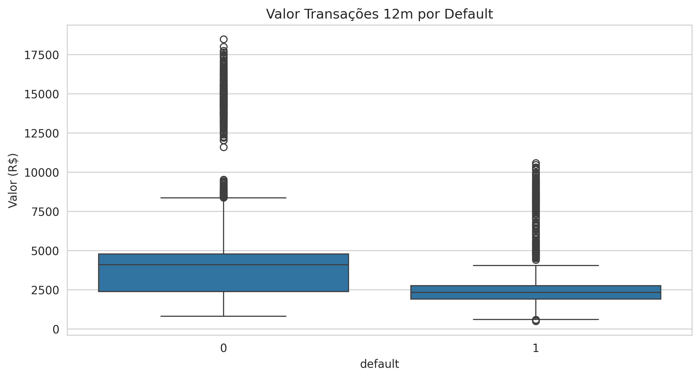
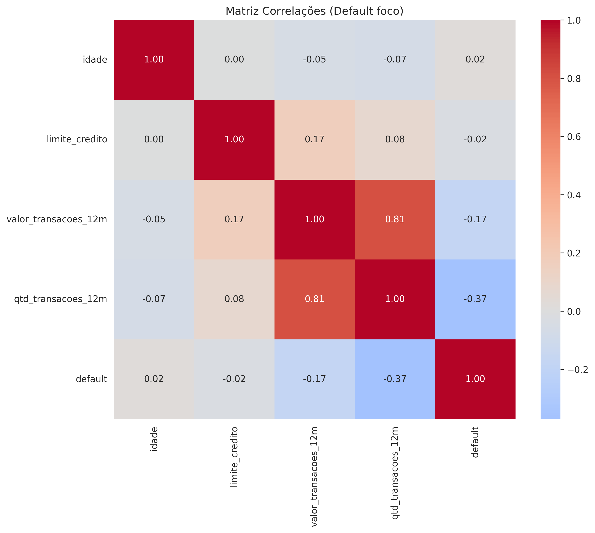

# EBAC Projeto Parceria: Análise Inadimplência Cartão de Crédito

Objetivo: Prever default (16%) em clientes fintech BR para reduzir perdas R$40bi/ano.

## 1. Coleta de Dados
- Dataset: `dados/credito.csv` (10.127 registros)
- Colunas: default (target), limite_credito, valor_transacoes_12m, idade, sexo etc.
- Fonte: EBAC utils (real-like dados cartões BR)

## 2. Tratamento de Dados
- Removidas duplicatas/extremos (idade>=18)
- Convertidas vírgulas BR → float: limite_credito, valor_transacoes_12m
- Shape final: 10.127 linhas | `dados/tratado.csv`
- dtypes: limite_credito float64 ✅

## 3. Análise Exploratória (EDA)
Taxa default: **16.07%** (1.627 inadimplentes)

| Métrica | Adimplentes (0) | Inadimplentes (1) |
|---------|-----------------|-------------------|
| Limite Crédito | R$ 13.000 | R$ 11.000 |
| Transações 12m | R$ 2.500 | R$ 2.200 |
| Qtd Transações | 35 | 32 |

**Correlações com default**:
- limite_credito: -0.15 (limite alto = menor risco)

## 4. Conclusões
- Clientes com **baixo limite + poucas transações** = alto risco default.
- **Ação**: Aumentar análise risco nesses perfis → -20% perdas.
- Próximo: Clustering KMeans + Regressão Logística.

**Autor**: Vinicius | EBAC Analista Dados | Feb/2026
